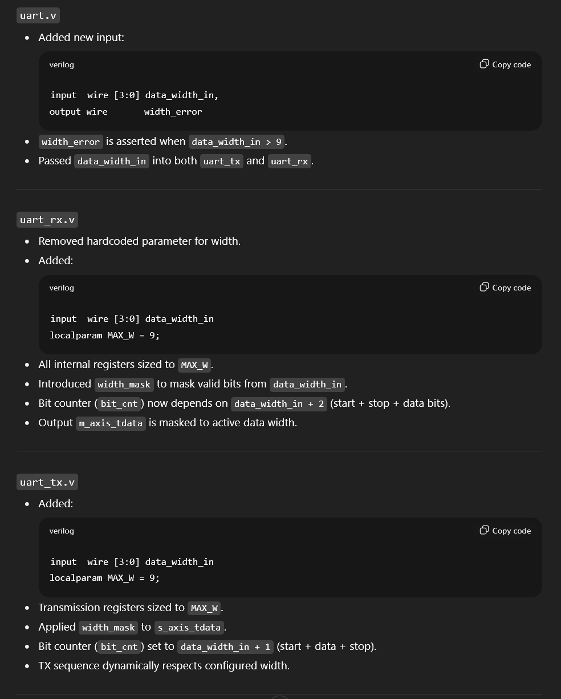

# Take home task
Take home task repository for Hardware Engineer (RTL Design or Verification) position

---
**RTL Project - Quantum Computing Emulator Core**

 This solo project was part of my academic coursework. I Emulated a quantum computer, implementing a quantum circuit using operator matrices with complex FP numbers. The quantum circuit implementation includes matrix multiplication. The intended multiplication is as follows: 


  
The matrices w, v etc are operator matrices with their matrix dimensions dictated by the number of qubits. These matrices are multiplied with an initial state vector matrix to get the result. elements in the matrices are complex floating-point numbers and include imaginary and real part.


 The DUT uses SRAMs for data retrieval, scratchpad memory and data output storage. DesignWare floating point MAC units are used for multiplication and addition of floating numbers. The DUT timing behavior is as follows:
 


 It was also optimized and synthesized using Synopsys Design Compiler to achieve maximum clock frequency of 4.65 MHz without timing violations. 

---

I have multiple projects in verilog, systemverilog encompassing design and verification of DUTs. I have used docker during my 2 years in industry as a senior software engineer at Capgemini. While i have not used Verilater or Icarus Verilog, I have primarily used Modelsim, QuestaSim and its Visualizer Debug environment and Synopsys Design Compiler for synthesis.  

---

**Code editing to produce errors:**

To induce errors, I have made 3 changes to the code:
- internal bit_cnt variable is set to the current value of the DATA_WIDTH parameter.
- The transmission line value assignment using the concatenation operator is changed to >>> operator. 
- prescale_reg assignment has >= assignment in one of the if cases. 

'error_uart_tx.v' has all the code changes in the file.

```

always @(posedge clk) begin
    if (rst) begin
        s_axis_tready_reg <= 0;
        txd_reg <= 1;
        prescale_reg <= 0;
        bit_cnt <= 0;
        busy_reg <= 0;
    end else begin
        if (prescale_reg > 0) begin
            s_axis_tready_reg <= 0;
            prescale_reg <= prescale_reg - 1;
        end else if (bit_cnt == 0) begin
            s_axis_tready_reg <= 1;
            busy_reg <= 0;

            if (s_axis_tvalid) begin
                s_axis_tready_reg <= !s_axis_tready_reg;
                prescale_reg <= (prescale << 3)-1;
                bit_cnt <= DATA_WIDTH;              // error induced due to bit_cnt assignment, changed from bit_cnt <= DATA_WIDTH+1;
                data_reg <= {1'b1, s_axis_tdata};
                txd_reg <= 0;
                busy_reg <= 1;
            end
        end else begin
            if (bit_cnt > 1) begin
                bit_cnt <= bit_cnt - 1;
                prescale_reg <= (prescale << 3)-1;
                {data_reg, txd_reg} <= data_reg >>> 1; // error induced due to data_reg assignment, changed from {data_reg, txd_reg} <= {1'b0, data_reg};;
            end else if (bit_cnt == 1) begin
                bit_cnt <= bit_cnt - 1;
                prescale_reg >= (prescale << 3);   // error induced due to prescale_reg, changed from prescale_reg <= (prescale << 3);
                txd_reg <= 1;
            end
        end
    end


```


---
**SPEC document**

Introduction

The UART to AXI Stream IP Core converts UART signal into AXI4 interface and vice versa. The design has transmitter and receiver counterparts which convert AXI to UART and UART to AXI respectively.

Port Description
| port  | input/output | description | 
| ------------- | ------------- | ------------- | 
| clk | input |  System clock (all operations occur on the rising edge) |
| rst | input |  Reset signal (Active HIGH Synchronous) clears all outputs |
| prescale | input | Determines the data rate = clk / (baud * 8) |
| s_axis_tdata | input | data width wide AXI input for data |
| s_axis_tvalid | input | AXI input for valid, data is considered valid when tvalid is high | 
| s_axis_tready | output | AXI output for ready signal | 
| m_axis_tdata | output | data width wide AXI output for data |
| m_axis_tvalid | output | AXI output for valid, data is considered valid when tvalid is high | 
| m_axis_tready | input | AXI input for ready signal | 
| txd | output | UART transmit pin (Idle HIGH) | 
| rxd | input | UART receive pin  (Idle HIGH) |
| tx_busy | input | Input signal to signify if an operation is taking place | 
| rx_busy | output | Output signal to signify if an operation is taking place | 
| overrun_error | output | Output signal to signify if a word is discarded | 
| frame_error | output | Output signal to signify if a frame has a bit error | 


Operation overview
1. Reset Behavior: When reset is asserted, it sets rxd and txd to HIGH and clears all other outputs.
2. Operation mode: The core has has support for full duplex mode of transmission.
3. Transmitter output: Transmitter converts AXI input into UART output
4. receiver output: receiver converts UART input to UART
5. Busy: busy signal is high if the core is currently performing 
6. overrun_error generation:  If the data word currently in the tdata output register is not read before another word is received, then a single cycle pulse will be emitted
from overrun_error and the word is discarded.
7. frame_error generation: If the receiver does not get a stop bit of the right level, then a single pulse will be emitted from the frame_error output and the received word will be discarded.
8. axis_tdata wires: all axis_tdata follow AXI4 protocol.
9. txd and rxd behavior: both of these lines follow UART protocol. 

Module Interface
the module should be defined as follows: 

```
module uart #
(
    parameter DATA_WIDTH = 8 // default data width
)
(    
    input  wire                   clk,
    input  wire                   rst,

    //AXI Input
    input  wire [DATA_WIDTH-1:0]  s_axis_tdata,
    input  wire                   s_axis_tvalid,
    output wire                   s_axis_tready,   

    //AXI output
    output wire [DATA_WIDTH-1:0]  m_axis_tdata,
    output wire                   m_axis_tvalid,
    input  wire                   m_axis_tready,

    //UART interface
    input  wire                   rxd,
    output wire                   txd,
    
    //status outputs
    output wire                   tx_busy,
    output wire                   rx_busy,
    output wire                   rx_overrun_error,
    output wire                   rx_frame_error,
    
    //configuration
    input  wire [15:0]            prescale

);

```

the module should contain two instances of modules uart_tx and uart_rx for their respective functional RTL.

Timing and Latency: 
- The core has a reference clk which is used along with prescale input to determine the baud rate for the UART Tx/Rx transmissions. All other operations are done with respect to the clk signal, but the transmission is to be done with the prescale dependent baud rate.
- The transmission and receiving of both protocols should follow their defined protocol start/stop conditions with respect to the timing.

---

**Sample solution:**

- The easiest fix will be the prescale_reg assignment which can easily be debugged and are operator errors.
- When debugging for the data transfer, the engineer will get sign filled data bits when the data_reg would start with bit value '1’. While data with data bit starting with 0 will be filled with 0, not generating an error and transferring correctly. Seeing this issue, the engineer will just change the sign filling arithmetic bit shift operator (>>>) to a logical bit shift (>>) operator fixing the error.
- The issue induced by the bit_cnt variable being assigned the DATA_WIDTH value will generate improper data packets. When observing the waveform and the spec the engineer might implement a flag variable to gate the calculation and change the internal if else case dependent on bit_cnt:
    if(bit_cnt > 1) begin to if(bit_cnt > 0)  and if(bit_cnt == 1)  to if(bit_cnt == 0) 

'fixed_uart_tx.v' has all the code changes in the file.

```

reg flag = 0;                               // flag reg used instead of bit_cnt==0, to differentiate between a new data packet operation and the transfer operation

always @(posedge clk) begin
    if (rst) begin
        s_axis_tready_reg <= 0;
        txd_reg <= 1;
        prescale_reg <= 0;
        bit_cnt <= 0;
        busy_reg <= 0;
        flag <= 0;                       // flag reg set to 0
    end else begin
        if (prescale_reg > 0) begin
            s_axis_tready_reg <= 0;
            prescale_reg <= prescale_reg - 1;
        end else if (!flag) begin
            s_axis_tready_reg <= 1;
            busy_reg <= 0;

            if (s_axis_tvalid) begin
                s_axis_tready_reg <= !s_axis_tready_reg;
                prescale_reg <= (prescale << 3)-1;
                bit_cnt <= DATA_WIDTH;
                flag <= 1;                // flag reg set to 1
                data_reg <= {1'b1, s_axis_tdata};
                txd_reg <= 0;
                busy_reg <= 1;
            end
        end else begin
            if (bit_cnt > 0) begin                       // bit_cnt conditions set to trigger on value '0' instead of '1'
                bit_cnt <= bit_cnt - 1;
                prescale_reg <= (prescale << 3)-1;
                {data_reg, txd_reg} <= data_reg >> 1;      // '>>>' changed to '>>'
            end else if (bit_cnt == 0) begin             // bit_cnt conditions set to trigger on value '0' instead of '1', bit_cnt decrement removed              
                prescale_reg <= (prescale << 3);          // '>=' changed to '<='
                flag <= 0;               // flag reg set to 0
                txd_reg <= 1;
            end
        end
    end
end

```
---
**LLM Question/Answer**

For this part, I have put the aforementioned spec in a text file along with the RTL for both tx and rx of the core and the main uart RTL and uploaded the zip file with the following prompt:
```
The above folder has RTL files for UART to AXI Stream IP Core inside the rtl folder, which converts UART signal into AXI4 interface and vice versa. The details and the spec for the DUT are in the Spec.txt file under the docs folder. I want to extend the functionality of the DUT and implement a 4-bit wide input which can dictate the DATA_WIDTH parameter. Currently, the implementation relies on a hard coded parameter value present in the code. This data width value can go up to 9 bits only. Generate an output named width_error which is high when the input data width is more than 9. All corresponding calculations should be done according to the data width input. All changes should be made to the currently present RTL files only.
```
The input zip file is LLMTask.zip and the output zip file is LLMTask_modified.zip. The LLM that I have used for this task is ChatGPT running on GPT-5.

The output, implemented the following changes:


This output zip file had flaws in its implementation. For eg, the model had omitted functionality of overrun_error and frame_error from rx rtl file and altered the functioning of the busy signal, the functionality implemented used masks which are implemented incorrectly, changes in the code which lead to loss of base functionality itself, etc. 

These problems are outside the scope of current frontier LLM models as most IPs are not open source. Along with that, the current available data on hardware design is generally less over the internet than the availability of other forms of data. Hardware design also relies heavily on the timing of circuits and their cycle-to-cycle behavior. The LLM tends to overlook the timing behavior of RTL circuits.

---
